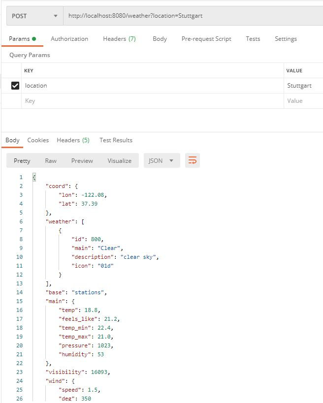
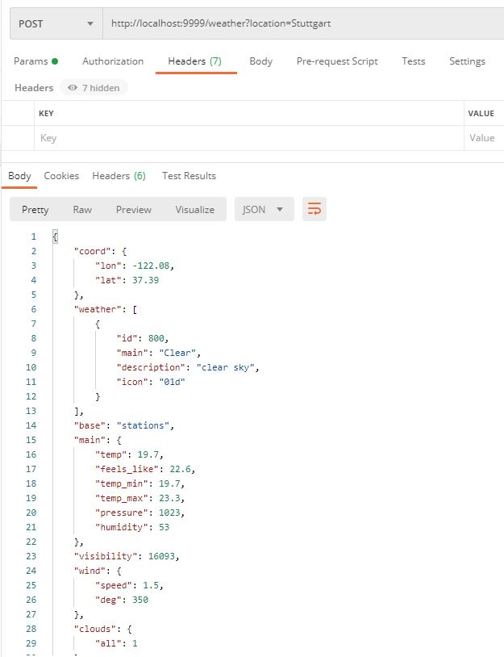
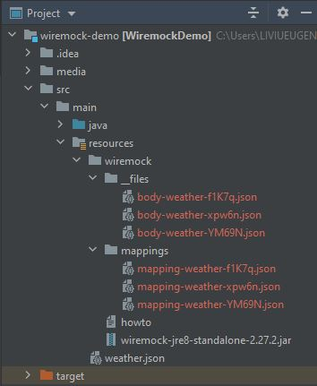

# wiremock-demo

To try the Wiremock demo out, please follow this steps:

1. Clone the repository to your favorite IDE (Eclipse, IntelliJ, Netbeans, etc.)
2. Import as Maven project
3. Build the project with Maven -> clean package
4. Run the main class "WiremockDemoApplication". Application will start on port 8080
5. Using Postman (or something similar), you can execute requests like:
- http://localhost:8080/weather?location=Stuttgart
- http://localhost:8080/weather?location=Hamburg
- http://localhost:8080/weather?location=Berlin

This will return a JSON response message containing the location name and the temperatura values specific for that location.

6. Start the standalone Wiremock jar in recording modem using the Windows command from src/resources/wiremock/:
_java -jar wiremock-standalone-3.3.1.jar --port 9999 --proxy-all="http://localhost:8080" --record-mappings --verbose_

- -- port 9999 = This is the port used by Wiremock
- --proxy-all="http://localhost:8080" = redirect all responses and requests to and from localhost:8080. This means that all traffic from this address is redirected through Wiremock
- --record-mappings = Save/Record all requests and responses
- --verbose = turn on verbose logging

7. Using Postman (or something similar), you can execute the same requests, but use the Wiremock port instead of the port of the real rest service (8080 -> 9999):
- http://localhost:9999/weather?location=Stuttgart
- http://localhost:9999/weather?location=Hamburg
- http://localhost:9999/weather?location=Berlin

This will result in the same response message as provided by the "real" service.
All actions are recorded in the wiremock/ folder:

8. Stop wiremock and re-run it in playback mode, without recording:
   java -jar wiremock-standalone-3.3.1.jar --port 9999 --verbose
 
9. Now, all recorded stubbings are available. For testing use the same links form point 7.
You can change the content of the response message, however you want, or however it is required for the testcase. Wiremock will return the manipulated message. (Every change requires a Wiremock restart)